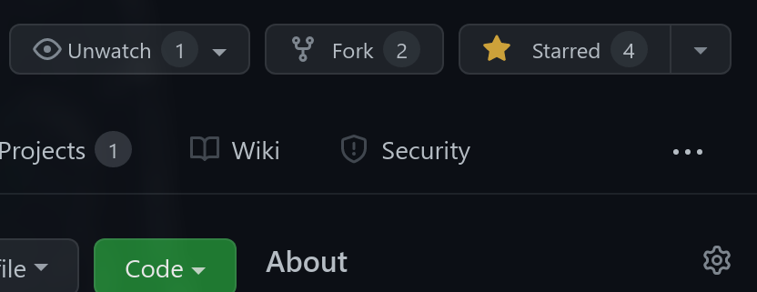

# Cow translator 🐮


Official moo translator to communicate with cows 🐮 

# Installation 📦

## Arch Linux 🐧

Cow translator is available in the AUR

```bash
yay -S cow-translator
```

## Other 🪟🐧

## With make - Linux 🐧

Run make

```bash
# 📂 cow-translator/
make
```

## Build from source - Linux 🐧 & Windows 🪟

**Clone this repo**

```bash
git clone https://github.com/SkwalExe/cow-translator.git
```

build with [cargo](https://doc.rust-lang.org/cargo/getting-started/installation.html)

```bash
# 📂 cow-translator/
cargo build --release
```

**[ LINUX ONLY ] :** Move the binary

```bash
# 📂 cow-translator/
sudo cp target/release/cow-translator /usr/bin/cow-translator
```

**On windows** the executable will be `target\release\cow-translator.exe` you can move it wherever you want.

# Usage 📝


## Example 

```bash
$ cow-translator -- Hello 

 => mOoOoOO moooOoo mooOoOO mooOoOO mooOOOo mOOOOOo mOOOoOo mooOOOo moOoooO mooOoOO mooooOO
```

# Troubleshooting 🔧

**Error:**

```
/app/target/release/cow-translator: /lib/x86_64-linux-gnu/libc.so.6: version `GLIBC_2.33' not found (required by /app/target/release/cow-translator)
```

**Solution:**

Compile with 

```bash
RUSTFLAGS='--cfg procmacro2_semver_exempt' cargo build  --release
```

# Docker 🐳

## Run the latest version

```bash
docker run --rm -it ghcr.io/skwalexe/cow-translator:main
```

## Test your changes 🚧

### Build 🛠️

```bash
# 📂 cow-translator/
docker build -t cow-translator .
```

### Run 🏃

```bash
docker run --rm -it cow-translator [OPTIONS]
```

# Uninstall 🗑

## With make

Run make uninstall

```bash
# 📂 cow-translator/
make uninstall
```

## Or
Just remove the binary

```bash
sudo rm /usr/bin/cow-translator
```

# Setting up development environment

For this project, I recommend Visual Studio Code.

You'll need to install the rust extension

```
ext install rust-lang.rust
```

# contributing

Start by **forking** this repository.



Then clone your fork to your local machine.

```git
git clone https://github.com/your-username/cow-translator.git
```

Create a new branch

```git
git checkout -b super-cool-feature
```

Then [edit the source code](#setting-up-development-environment) in the `📂/src/` folder.

Once you're done, commit your changes and push them to the remote repository.

```git
git add --all
git commit -m "Add super-cool-feature"
git push origin super-cool-feature
```

Then, open a pull request on GitHub from your fork.

# final

If you have any problem, don't hesitate to open an issue

<a href="https://github.com/SkwalExe#ukraine"></a>