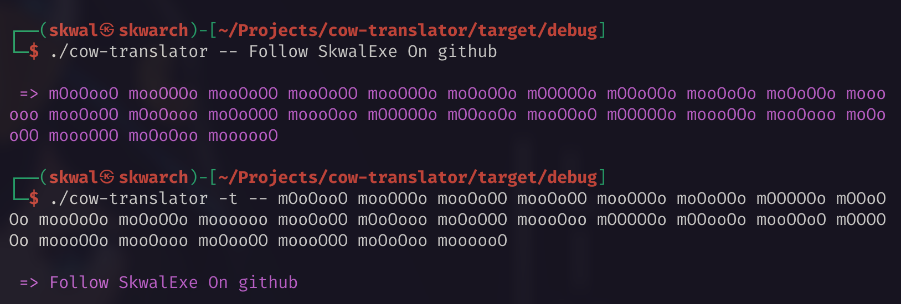
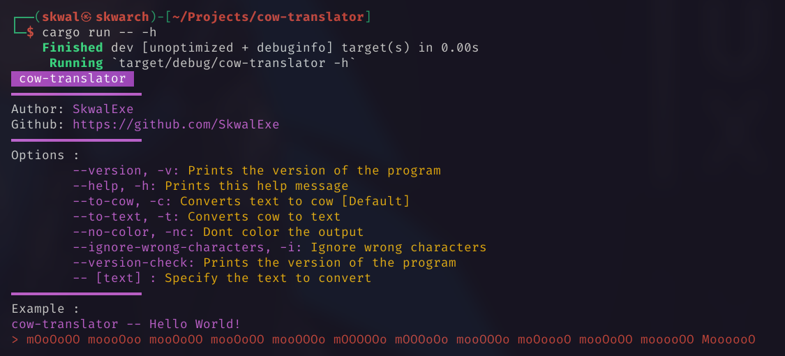

# Cow translator 🐮




Official moo translator to communicate with cows 🐮 

# Installation 📦

## Arch

Cow translator is available in the AUR

```bash
yay -S cow-translator
```

## Other distros

**Clone this repo**

```bash
git clone https://github.com/SkwalExe/cow-translator.git
```

build with [cargo](https://doc.rust-lang.org/cargo/getting-started/installation.html)

```bash
# 📂 cow-translator/
cargo build --release
```

Move the binary

```bash
# 📂 cow-translator/
sudo cp target/release/cow-translator /usr/bin/cow-translator
```

**On windows** the executable will be `target\release\cow-translator.exe` you can move it wherever you want.

# Usage 📝



## Example 

```bash
$ cow-translator -- Hello 

 => mOoOoOO moooOoo mooOoOO mooOoOO mooOOOo mOOOOOo mOOOoOo mooOOOo moOoooO mooOoOO mooooOO
```

# Uninstall 🗑

Just remove the binary

```bash
sudo rm /usr/bin/cow-translator
```

# final

If you have any problem, don't hesitate to open an issue

# contributing

Pull requests are welcome. For major changes, please open an issue first to discuss what you would like to change.

<a href="https://github.com/SkwalExe#ukraine"></a>